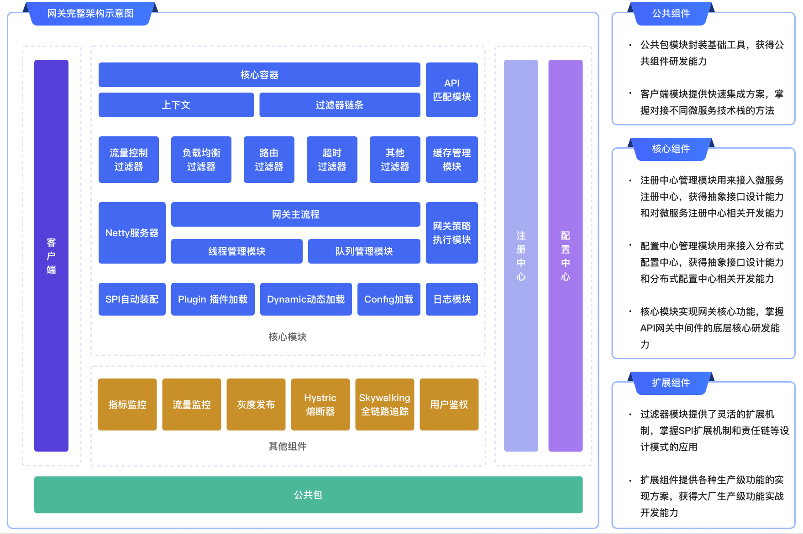

[//]: # (# 基于Nacos和Netty的自研网关)

[//]: # (
)

[//]: # (    <a href="" target="_blank">)

[//]: # (      )

[//]: # (    </a>)

[//]: # (
)
<h1 align="center">Java-Flow 智能网关组件</h1>

<strong>
    基于基于Nacos和Netty的自研网关。
     专注于路由转发与服务过滤与三高（高可用、高性能、高扩展）🚀。。
     <em>持续更新中～</em>
</strong>

    

## 一、项目介绍
 基于基于Nacos和Netty的自研网关，专门用于解决统一用户鉴权，监控可观测性，灰度发布，流量控制，超时，重试等过程中的各种疑难问题。
## 二、项目架构图：
 
## 项目技术栈
- 网关：Netty
- 注册中心：Nacos
- 配置中心：Nacos
- Java：JDK1.8
- Maven：3.6.3

## 三、功能介绍
- 动态路由转发
- 动态负载均衡
- 动态配置
- 动态日志
- 动态网关
## 未完待续。。。

## 四、如何参与

如果您对本项目感兴趣，欢迎通过以下方式参与：

1. **Fork 本项目**：在 GitHub 上 Fork 这个仓库到您自己的账号下。
2. **创建分支**：从您 Fork 的仓库中创建新的分支，用于开发新功能或修复问题。
3. **提交代码**：在本地完成代码开发后，将代码提交到您创建的分支上。
4. **发起 Pull Request**：向本项目的主仓库发起 Pull Request，我们会及时审核您的代码。

希望这个项目能为您带来丰富的学习体验和收获，感谢您的关注和支持！